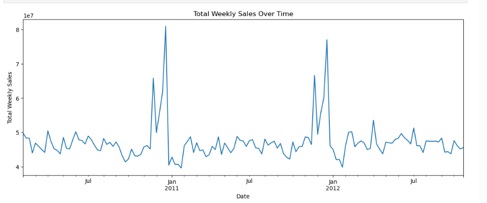
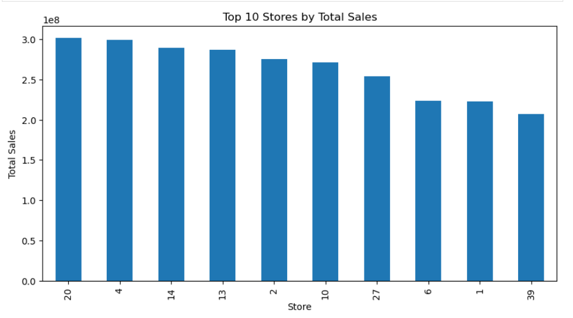
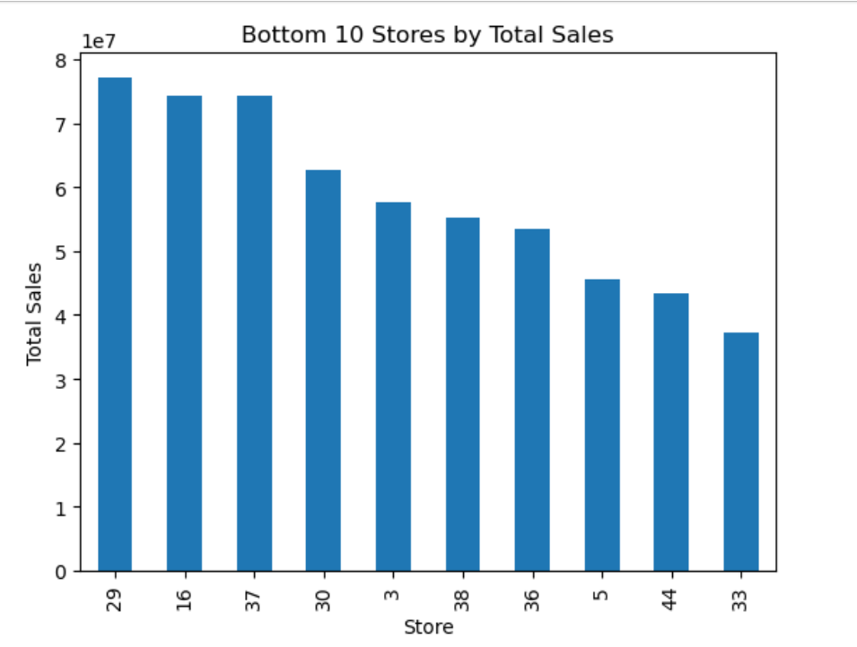
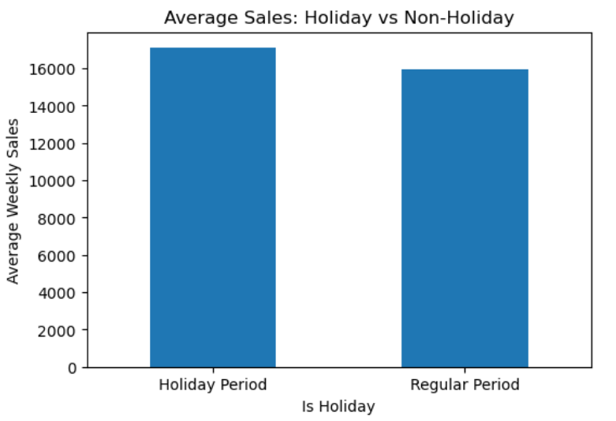
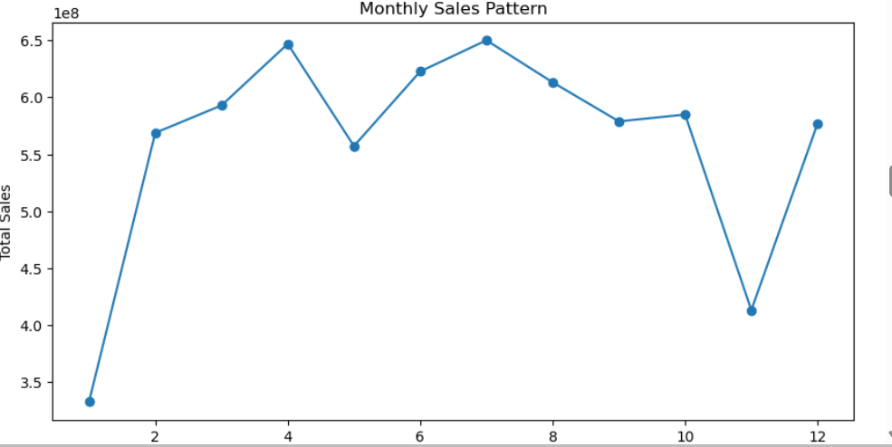
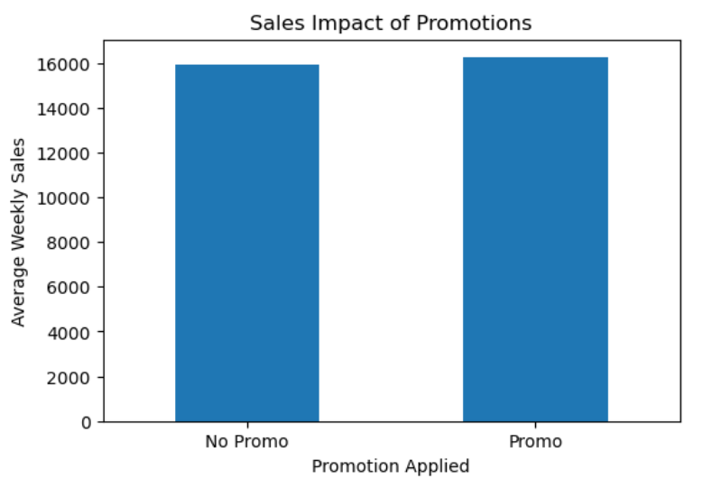
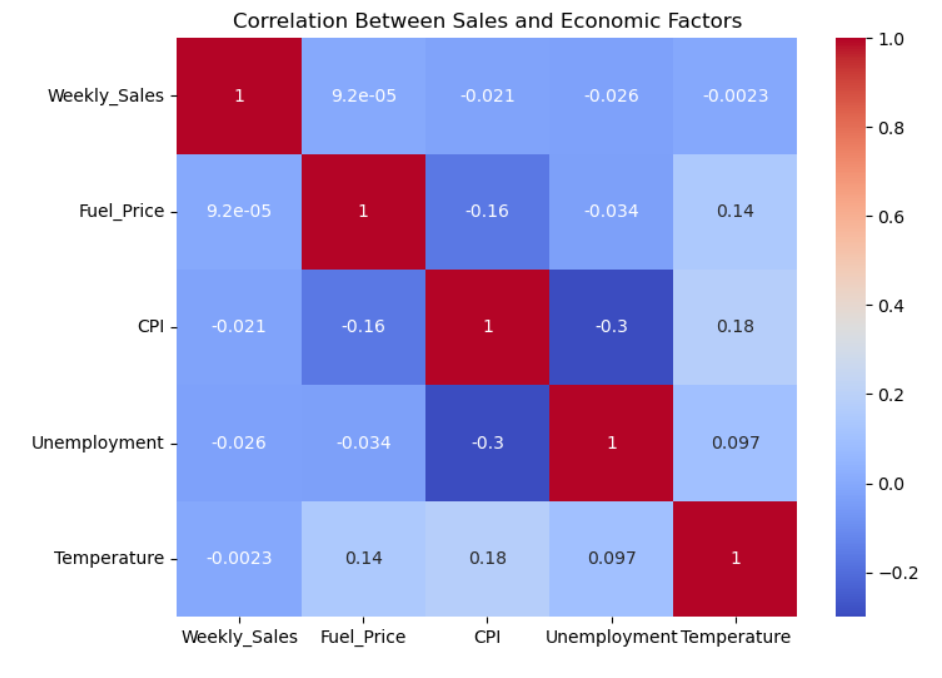
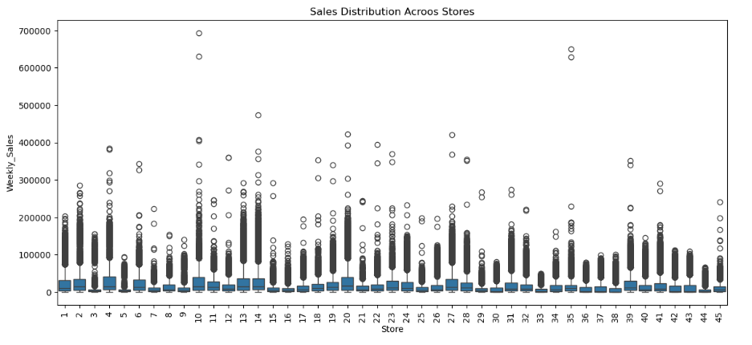
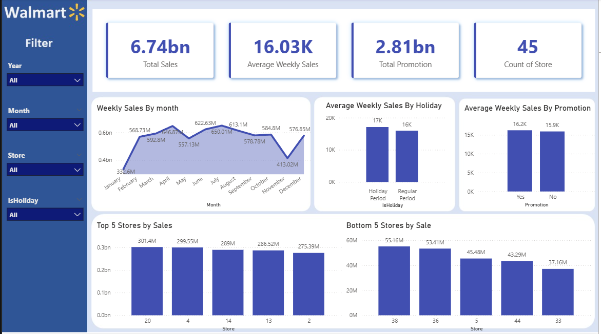

#  Walmart Sales Analysis Dashboard

##  Project Overview

This project analyzes Walmart’s historical **weekly sales data** to understand how sales are influenced by **seasonality, holidays, promotions (markdowns), and economic factors**.
The analysis combines **Python-based data exploration** with an **interactive Power BI dashboard** to deliver business-ready insights that support **inventory planning, promotional strategy, and demand forecasting**.

---

##  Business Objectives

The analysis aims to answer the following key business questions:

* How are overall sales performing over time?
* Which stores contribute the most and least to total revenue?
* Do holidays significantly increase weekly sales?
* Is there seasonality in Walmart sales?
* Do promotions (markdowns) meaningfully impact sales?
* Do economic factors affect weekly sales?
* Are there unstable or risky stores that are hard to forecast?

---

##  Dataset Description

**Source:** Public Walmart Sales Dataset

**Granularity:** Weekly sales at **store–department** level

**Dataset Size:**

* **Rows:** 421,570
* **Columns:** 14

### Key Columns

* `Store` – Store identifier
* `Dept` – Department identifier
* `Date` – Week of sales
* `Weekly_Sales` – Weekly revenue
* `IsHoliday` – Holiday indicator
* `MarkDown1–5` – Promotion values
* `CPI`, `Fuel_Price`, `Unemployment`, `Temperature` – Economic indicators

---

##  Key Analysis Questions & Findings

### **4.1 How are overall sales performing over time?**

Weekly sales remain mostly stable throughout the year, with **clear spikes during major holidays** such as Thanksgiving and Christmas. After these peaks, sales return to normal levels, indicating that the increase is **temporary and holiday-driven**, not long-term growth.

---

### **4.2 Which stores perform best and worst?**

Sales performance varies significantly across stores.

**Top-performing stores:**

* Store 20
* Store 4
* Store 14
* Store 13

**Lowest-performing stores:**

* Store 33
* Store 44
* Store 5
* Store 36

A small number of stores generate a large portion of total revenue.

---

### **4.3 Do holidays increase sales?**

Average weekly sales show only a **slight difference**:

* **Regular weeks:** ~15,950
* **Holiday weeks:** ~17,093

Only **major holidays** drive noticeable spikes.

**Insight:**
Holiday impact is **event-specific**, not consistent across all holiday weeks.

---

### **4.4 Is there seasonality in sales?**

Yes, sales follow a clear seasonal pattern:

* Weaker sales at the beginning of the year
* Stronger performance mid-year and year-end
* A dip around November, followed by recovery in December

Seasonality plays a key role in demand planning.

---

### **4.5 Do promotions (MarkDowns) affect sales?**

* **Without promotions:** ~15,919 average weekly sales
* **With promotions:** ~16,229 average weekly sales

Promotions increase sales by about **310**, which represents a **modest uplift**.

**Insight:**
Promotions help slightly but do not create large overall sales jumps.

---

### **4.6 Do economic factors affect sales?**

The correlation between weekly sales and economic indicators (CPI, fuel price, unemployment, temperature) is **very weak**.

**Insight:**
Short-term economic changes do not strongly influence weekly sales.

---

### **4.7 Are there unstable or risky stores?**

**Most unstable (large spikes):**

* Store 10
* Store 35
* Store 23
* Store 13

**Risky (consistently low sales):**

* Store 33
* Store 5
* Store 9
* Store 44

**Insight:**

* Extreme spikes make forecasting difficult
* Consistently low sales indicate long-term performance risk

---

##  Power BI Dashboard Overview

---

## Tools & Technologies

* **Python:** Pandas, NumPy, Matplotlib, Seaborn
* **Power BI:** Interactive dashboards & DAX measures
* **Jupyter Notebook:** Data cleaning and analysis
* **GitHub:** Version control and project sharing

---

##  Business Recommendations

* Increase inventory levels before major holidays
* Focus improvement strategies on low-performing stores
* Monitor unstable stores separately to reduce forecasting risk
* Use seasonal trends for demand planning
* Evaluate promotion effectiveness at store or department level

---

## 📄 Final Summary

This analysis shows that Walmart’s weekly sales are primarily driven by **seasonality, holidays, and store-level behavior**. Promotions provide a small uplift, while economic factors have minimal short-term impact. A clear gap exists between top-performing and underperforming stores, creating opportunities for targeted operational and strategic improvements.

---

## 👤 Author

**Ayman Khan**

Aspiring Data Analyst / Data Scientist

📍 Portfolio Project

